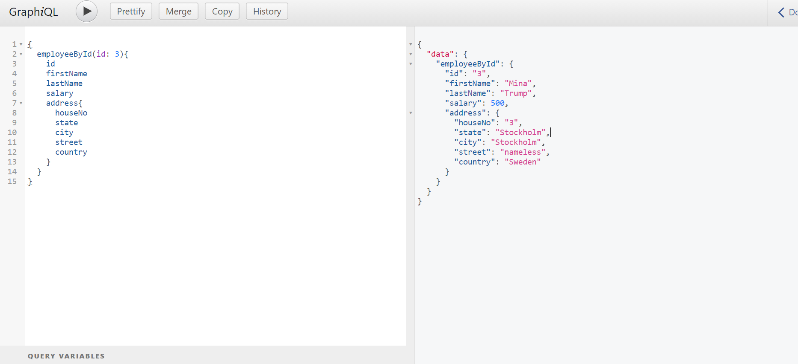

# GraphQL demo

This demo project shows how to use GraphQL Java and Springboot to establish a minimal server to handle API requests.

To use it, open `gradle` view in IntelliJ IDEA and load the project, and then run the GraphqlDemoApplication, and then access `localhost:8090` to execute a query. To learn the grammar of the query, please refer to [doc](https://www.graphql-java.com/documentation/v16/execution/).

One sample can be following:

